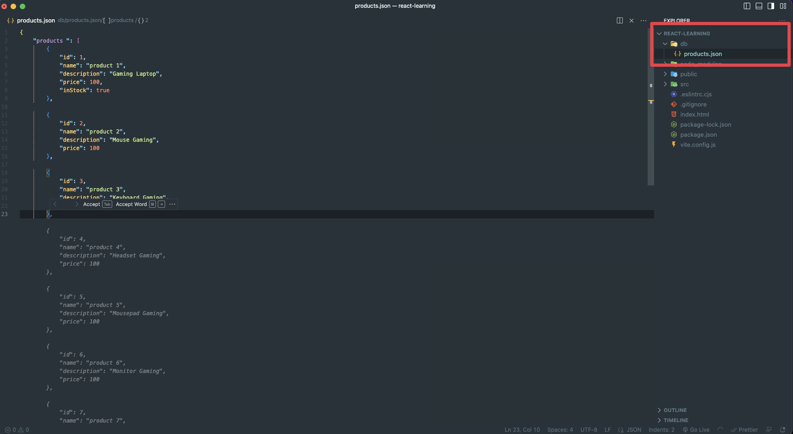

Installation:

```bash
npm i json-server
```

Then Create a small json document with some data:


Lastly add a small script where your will run your backend document on the package.json file inside scripts to run the json server easily:

```json
"back": "json-server --watch db/products.json --port 3002"
```

Then just run **npm run back** in the terminal and it will launch the server
